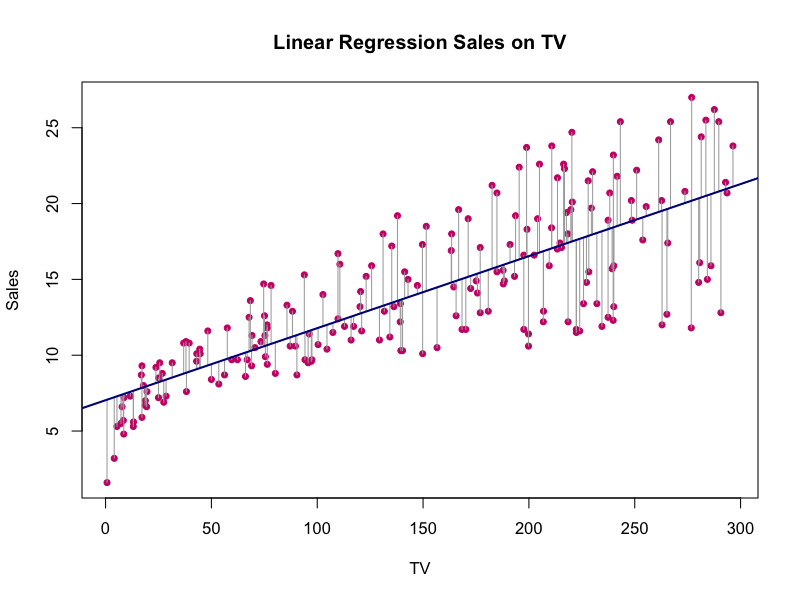

#Abstract 

This report is about reproducing many regression analysis from Section 3.2 (pages 71-82), of *Chapter3. Linear Regression*, from the book "An Introduction to Statistical Learning" [(by James et al)](http://www-bcf.usc.edu/~gareth/ISL/)

# Introduction

The goal is to provide advice on how to improve sales of the particular product. The idea is to determine whether there is relationship between advertising expenditure and sales, and if so, we would like to know the strengh of this relationship and then we can instruct our client to adjust advertising budgets, thereby indirectly increasing sales.In other word, our goal is to develop an accurate model that can be used to prodict sales on the basis of the three media (TV, radio, newspaper) budgets.


# Data

The [Advertising data set](http://www-bcf.usc.edu/~gareth/ISL/Advertising.csv) consists of Sales (in thousands of units) of a particular product in 200 different markets (n = 200), along with advertising budgets (in thousands of dollars) for the product in each of those markets for three different media: TV, Radio, and Newspaper.

# Methodology

## Simple Linear Regression

Simple linear regression, as we did in homework 2, is a useful approach for predicting a response on the basis of a single predictor variable. However, in practice we often have more than one predictor. In our `Advertising` data, we have examined the relationship between `Sales` and `TV` advertising in the second homework. We also have data for the amount of money spent advertising on the radio and in newspapers, and we may want to know whether either of these two media is associated with sales. 

For exmaple, we suppose that only one media from the data set, **TV**, has an association with **Sales**. Therefore, we use a simple linear model: 

$$ \hat{Sales} = \hat{\beta_0} + \hat{\beta_1} \times TV $$

we have used our training data to produce estimates $\hat{\beta_0}$ and $\hat{\beta_1}$ for the model coefficients, where $\hat{Sales}$ indicates a prediction of *Sales* on the basis of *TV*. 
To estimate the coefficients we fit a regression model via the least squares criterion.

How can we extend our analysis of the advertising data in order to accommodate these two additional prediction?

One option is to run three separate simple linear regressions, each of which uses a different advertising medium as a predictor. However, the approach of fitting a separate simple linear regression model for each predictor is not entirely satisfactory. First of all, it is unclear how to make a single prediction of sales given levels of the three advertising media budgets, since each of the budgets is associated with a separate regression equation. Second, each of the three regression equations ignores the other two media in forming estimates for the regression coefficients. We will see shortly that if the media budgets are correlated with each other in the 200 markets that constitute our data set, then this can lead to very misleading estimates of the individual media effects on sales. 


## Multiple Linear Regression

Instead of fitting a separate simple linear regression model for each predictor, a btter approach is to extend the simple linear regression model so that it can directly accommodate multipule predictors. In gerenral, suppose that we have `p` distinct predictors. Then the multiple linear regression model takes the form:

$$Y = \beta_0 + \beta_1  X_1 + \beta_2 X_2 ... + \beta_p  X_p + \epsilon$$

where $X_j$ represents the jth predictor and $\beta_j$ quantifies the association between that variable and the response. We interpret $\beta_j$ as the *average* effect on $Y$ of a one unit increase in $X_j$, *holding all other predictors fixed*. In the advertising example, it becomes:

$$Sales = \beta_0 + \beta_1\times TV + \beta_2\times radio + \beta_p\times newspaper + \epsilon$$

### Estimating the Regression Coefficients

Since the regression coefficients $\beta_0, \beta_1,...,\beta_p$ are unknown, and must be estimated. Therefore, we will estimate them and make predictions using the formula:

$$\hat{y} = \hat{\beta_0} + \hat{\beta_1}  X_1 + \hat{\beta_2} X_2 ... + \hat{\beta_p}  X_p$$

Then we minimize the sum of squared residuals:

$$ RSS = \sum_{i=1}^n\left(y_i-\hat{y_i}\right)^2 = \sum_{i=1}^n\left(y_i - \hat{\beta}_0 - \hat{\beta_1}x_{i1} - \hat{\beta_2}x_{i2} - ... - \hat{\beta_p} x_{ip}\right)^2 $$

### F-statisitc

In order to know whether there is a relationship between the response and predictors, we need to know *F-statistic*. In the multiple regression setting with `p` predictors, we need to ask whether all of the regression coefficients are zero. We test the null hypothesis:

$$H_0 = \beta_1 = \beta_2 = ... = \beta_p = 0$$

versus the alternative : $H_a$: at least one $\beta_j$ is non-zero.

This hypothesis test is performed by computing the *F-statistic*

$$F = \frac{(TSS - RSS)/p}{RSS/(n-p-1)}$$

hence, when there is no relationship between the response and predictors, one would expect the F-statistics to take on a value close to 1. On the other hand, if $H_a$ is true, we expect `F` to be greater than 1. 

# Results



This figure is the plot of Least Squares Simple Linear Regression.

For the Advertising data, the least squares fit for the regression of Sales onto TV is shown. The fit is found by minimizing the sum of squared errors. Each grey line segment represents an error, and the fit makes a compromise by averaging their squares. In this cuase a linear fit captures the essence of the relationship, although it is somewhat deficient in the left of the plot.


```{r xtable, results = 'asis',warning=FALSE, message=FALSE, echo=FALSE, comment = FALSE}
load("../data/regression.RData")
library(xtable)
# table 1:
print(xtable(summary(reg_TV)$coef, caption = "Simple regression of Sales on TV", type = "Latex"),comment = FALSE)
# table 2:
print(xtable(summary(reg_Radio)$coef, caption = "Simple regression of Sales on Radio", type = "Latex"), comment = FALSE)
# table 3:
print(xtable(summary(reg_Newspaper)$coef, caption = "Simple regression of Sales on Newspaper", type = "Latex"), comment = FALSE)
```

Table 1 displays the simple linear regression fit to the `Advertising` data, where $\hat{\beta_0}$ = `r reg_TV$coefficients[[1]]` and $\hat{\beta_1}$ = `r reg_TV$coefficients[[2]]`. In other words, according to this approximation, an additional $1,000 spent on TV advertising is associated with selling approximately `r round(reg_TV$coefficients[[2]]*1000,1)` additional units of the product. This table also provides details that t-statistics are large, this is because the coefficients for $\hat{\beta_0}$ and  $\hat{\beta_1}$ are very large relatvie to their standard errors. The probabilities of seeing such values if $H_0$ is true are virtually zero. Hence we can conclude that $\hat{\beta_0}$ and  $\hat{\beta_1}$ do not equal to 0.

The small p-value in Table 1 for the intercept indicates taht we can reject the null hypothesis that $\hat{\beta_0} = 0$, and a small p-value for *TV* indicates that we can reject the null hypothesis that $\hat{\beta_1} = 0$. Rejecting the latter null hypothesis allows us to conclude that there is relationship between *TV* and *Sales*. Rejecting the former allows us to conclude that in the absence of *TV* expenditure, *Sales* are non-zero. 

Table 2 displays the simple regression of `Sales` on `Radio`, where $\hat{\beta_0}$ = `r reg_Radio$coefficients[[1]]` and $\hat{\beta_1}$ = `r reg_Radio$coefficients[[2]]`. We find that a $1,000 increase in spending on radio advertising is associated with an increase in sales by around `r round(reg_Radio$coefficients[[2]]*1000,1)` units. 

The small p-value for the intercept indicates taht we can reject the null hypothesis that $\hat{\beta_0} = 0$, and a small p-value for *TV* indicates that we can reject the null hypothesis that $\hat{\beta_1} = 0$. Rejecting the latter null hypothesis allows us to conclude that there is relationship between *Radio* and *Sales*. Rejecting the former allows us to conclude that in the absence of *Radio* expenditure, *Sales* are non-zero. 


Table 3 contains the least squares coefficients for a simple linear regression of slaes onto `Newspaper` advertising budget, where $\hat{\beta_0}$ = `r reg_Newspaper$coefficients[[1]]` and $\hat{\beta_1}$ = `r reg_Newspaper$coefficients[[2]]`. A $1,000 increase in newspaper advertising budget is associated with an increase in sales by approximately `r round(reg_Newspaper$coefficients[[2]]*1000,1)` units.

The small p-value for the intercept indicates taht we can reject the null hypothesis that $\hat{\beta_0} = 0$, and a small p-value for *Newspaper* indicates that we can reject the null hypothesis that $\hat{\beta_1} = 0$. Rejecting the latter null hypothesis allows us to conclude that there is relationship between *Newspaper* and *Sales*. Rejecting the former allows us to conclude that in the absence of *Newspaper* expenditure, *Sales* are non-zero. 


```{r, results = 'asis',warning=FALSE, message=FALSE, echo=FALSE, comment = FALSE}
load("../data/regression.RData")
load("../data/correlation-matrix.RData")

# table 4
print(xtable(summary(reg_multi)$coef, caption = "Coefficient estimates of the least squares model", type = "Latex"), comment = FALSE)
```

Table 4 displays the multipule regression coefficient estimates when TV, radio and newspaper advertising budgets are used to predict product sales using the `Advertising` data. A given amount of TV and newspaper advertising, spending an additional $1000 on radio advertising leads to an increase in sales by approximately `r round(reg_multi$coefficients[[3]],1)` units. Comparing these coefficient estimates to those displayed in Table 1,2 and 3, we notice that the multiple regression coefficient estimates for *TV* and *Radio* are pretty similiar to the simple linear regression coefficient estimates. However, while the *Newspaper* regression soefficient estimate in Table 3 was significantly non-zero, the coefficient estimate for *Newspaper* in the multiple regression model is close to zero, and the corresponding p-value is no longer significant, with a value around `r round(summary(reg_multi)$coefficient[4,4],3)`. Therefore, simple and multiple regression coefficientes can be quite different. 

The difference stems from the fact that in the simple regression case, the slope term represents the average effect of a $1000 increase in newspaper advertising, ignoring other predictors such as *TV* and *radio*. In contrast, in the multiple regression setting, the coefficient for *newspaper* represents the average effect of increasing newspaper spending by $1000 while holding *TV* and *Radio* fixed.

```{r, results = 'asis',warning=FALSE, message=FALSE, echo=FALSE, comment = FALSE}
# table 5:
corm_eda[lower.tri(corm_eda)] <- NA
print(xtable(corm_eda, caption = "Correlation matrix for TV, radio, newspaper, and sales for the Advertising data", type = "Latex"), comment = FALSE)

```

Table 5 displays the correlation matrix for the three predictor variables `TV, Radio, Newspaper` and response variable `Sales`. Notice that correlation between `radio` and `newspaper` is `r round(corm_eda[2,3], 3)`. This reveals a tendency to spend more on newspaper advertising in markets where more is spent on radio advertising. Now suppose that the multiple regression is correct and newspaper advertising has no direct impact on sales, but radio advertising does increase sales. Then in markets where we spend more on radio our sales will tend to be higher, and as our correlation matrix shows, we also tend to spend more on newspaper advertising in those same markets. Hence, higher values of `newspaper` tend to be associated with higher values of `sales`, even though newspaper advertisting does not actually affect sales. So `newspaper` sales are a surrogate for `radio` advertising; `newspaper` gets "credit" for the effect of `radio` on `sales`.

```{r,results = 'asis',warning=FALSE, message=FALSE, echo=FALSE, comment = FALSE}
source("../code/functions/regression-functions.R")
#table 6: 
f = round(f_statistic(reg_multi),1)
rse = round(residual_std_error(reg_multi),2)
r2 = round(r_squared(reg_multi),3)
c = c("Residual standard error","R2", "F-statistic")
v = c(rse,r2,f)
qq = data.frame(c,v)
colnames(qq) <- c("Quantity","Value")
print(xtable(qq, type = "html", caption = "Regression Quality Indices: regression of Sales on TV, radio and nespaper"),comment = FALSE, include.rownames = FALSE)
```

####Q1:Is at least one of the predictors useful in predicting the response?

A: YES.

Table 6 shows the F-statistic for the multiple linear regression model obtained by regressing `Sales` onto `Radio`, `TV` and `newspaper`. In this example the F-statistic is `r f`. Since this is far larger than 1, it provides compelling evidence against the null hypothesis $H_0$. In other words, the large F-statistic suggests that at least one of the advertising media must be related to `Sales`. 

###Q2:Do all predictors help to explain the response, or is only a subset of the predictors useful?

A: Only a subset of the predictors useful.

Table 4 displays the p-values for vairables.Both `TV` and `Radio` have a sufficiently low p-values less than 0.05, which means that they are statistically significant and corresponding variables are important predictors; while for predictor `newspaper`, with p-value = `r  round(summary(reg_multi)$coefficient[4,4],3)` is very big. Since the p-value for varible `newspaper` is above 0.05, we remove this variable from the model. Therefore, only a subset of the predictors -- `TV` and `Radio` help to explain the response. 


###Q3: How well does the model fit the data?

A: An $R^2$ value close to 1 indicates that the model explains a large portion of the vairance in the response variable. In table 6 the model that uses all three advertising media to predict `sales` has an $R^2$ of `r r2`. In other words, this $R^2$ explain about `r paste(r2*100,"%")` of the variance in sales. 


The mean value of Sales over all markets is approximately `r mean(reg_multi$model[[1]])` in thousand units, and the RSE is `r rse`. Therefore, the percentage error is RSE divided by Sales mean is `r paste(round(rse/mean(reg_multi$model[[1]])*100,2), "%")`.

###Q4: How accurate is the prediction?

Once we have fit the multiple regression model, there are three sorts of uncertainty associated with this prediction. 

1.  The coefficient estimates $\hat{\beta_0},\hat{\beta_1},\hat{\beta_2},\hat{\beta_3}$ are estimates for $\beta_0,\beta_1,\beta_2,\beta_3$. That is, the *least squares plane*
$$\hat{Y} = \hat{\beta_0}+\hat{\beta_1} X_1+\hat{\beta_2} X_2 + \hat{\beta_3} X_3$$
is only an estimate for the *true population regression plane*

$$f(Y) = \beta_0+\beta_1 X_1+\beta_2 X_2 + \beta_3 X_3$$

The inaccuracy in the coefficent estimates is related to the *reducible error*. We can compute a *confidence interval* in order to determine how close $\hat{Y}$ will be to $f(X)$

2. In practice assuming a linear model for $f(X)$ is almost always an approximation of reality, so there is an additional source of potentially reducible error which we call *model bias*. So when we use a linear model, we are in fact estimating the best linear approximation to the true surface. However, here we will ignore this discrepancy, and operate as if the linear model were correct. 

3. Even if we knew $f(X)$ -- that is, even if we knew the true values for $\beta_0,\beta_1,\beta_2,\beta_3$-- the response value cannot be predicted perfectly because of the random error $\epsilon$ in the model. How much will $Y$ vary from $\hat{Y}$? We use *prediction intervals* to answer this question. Prediction intervals are always wider than confidence intervals, because they incorporate both the error in the estimate for $f(X)$ (the reducible error) and the uncertainty as to how much an individual point will differ from the population regression plane (the irreducible error). 

In this case, we use a *confidence interval* to quantify the uncertainty surrounding the *average* `Sales` over a large number of cities. On the other hand, a *prediction interval* can be used to quantify the uncertainty surrounding `Sales` for a *particular* city. The prediction interval is substantially wider than the confidence interval, reflecting the increased uncertainty about `Sales` for a given city in comparison to the average `Sales` over many locations.

# Conclusion
Based on tables above (`F-statistic`) from multiple regression, we find that at least one of the predictors is useful in predicting the response `Sales`. However, we also find that not all of the predictors (based on p-values) are statistically significant. Therefore, the prediction would be more accurate without the varible `newspaper` based on its corresponding p-value. If we need more evidence to support, it would be better if we also do regression of `Sales` on `Radio` and `TV`, or regression of `Sales` on `Radio` and `Newspaper` and so on. Then, based on $R^2$, `RSE`, and `P-values`, we will find more specific evidence to support removing `newspaper` varible.


